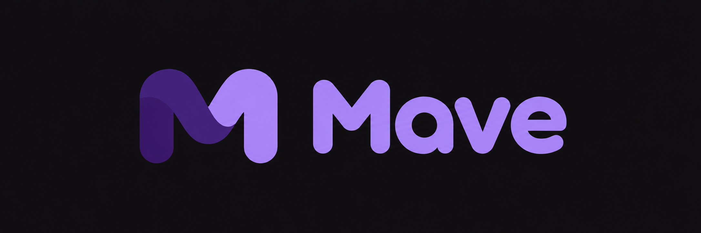

<p align="center">
	
</p>

# Mave

**Finanzas personales con claridad.** Una app web instalable para registrar tus movimientos, entender tus gastos y seguir tus metas de ahorro, sin conectar bancos ni billeteras.

## Qué podés hacer

- Registrar ingresos, gastos y transferencias entre tus cuentas.
- Consultar movimientos y resúmenes por período, categoría y moneda. ARS y USD se muestran por separado.
- Crear metas de ahorro y exportar tus datos.
- Cargar movimientos sin conexión y sincronizarlos al volver a usar la app con internet.

## Empezar

Requiere Node.js `>=22.12.0` y npm.

```sh
npm ci
npm run dev
```

Para autenticación y persistencia, configurá Supabase en `.env.local` usando las variables de `.env.example`. La [guía de validación](specs/001-personal-finance-tracker/quickstart.md) incluye los pasos y pruebas de base de datos.

## Estado

Mave está en desarrollo. La infraestructura remota y las validaciones de producción, como correo, aislamiento de datos, backups y uso en dispositivos reales, siguen pendientes. Usá solo datos de prueba.

## Documentación

- [Guía de desarrollo y validación](specs/001-personal-finance-tracker/quickstart.md)
- [Informe del producto](info/finanzas-pwa/informe-producto.md)
- [Logo y prompt para el banner del repositorio](info/finanzas-pwa/prompts-para-assets.md#6-banner-para-el-repositorio)

La licencia del proyecto todavía no está definida.
