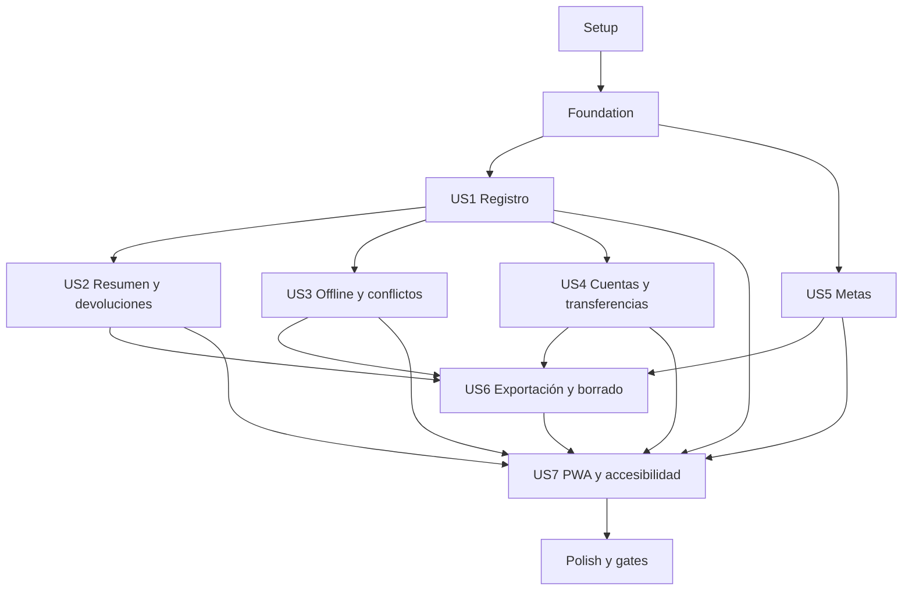

# Tasks: Mave - Finanzas personales

**Input**: Artefactos de diseño en `specs/001-personal-finance-tracker/`.

**Prerrequisitos**: `plan.md`, `spec.md`; además `research.md`, `data-model.md`, `contracts/` y `quickstart.md`.

**Pruebas**: se incluyen tareas de pruebas porque la spec tiene una sección obligatoria de escenarios y pruebas, criterios independientes por historia, y la constitución requiere validación de cálculos, aislamiento, sincronización y restauración. En cada historia, las pruebas preceden a la implementación y deben fallar primero por el comportamiento aún ausente.

**Organización**: Setup, Foundation y luego una fase por historia de usuario, en prioridad P1 y P2. Las tareas de cada historia producen un incremento verificable.

## Formato y rutas

Cada tarea usa `- [ ] Tnnn [P?] [USn?] descripción con rutas`. `[P]` indica trabajo que puede ejecutarse en paralelo sobre archivos distintos y sin dependencias incompletas. `[USn]` corresponde a las siete historias de `spec.md`. Se usa el árbol previsto en `plan.md`: `src/`, `tests/` y `supabase/` en la raíz. Setup materializa el shell, las herramientas compartidas y la configuración local; las migraciones, los manifiestos y los flujos de producto se crean en fases posteriores.

## Phase 1: Setup

**Propósito**: inicializar la SPA y las herramientas locales compartidas.

- [x] T001 Inicializar el proyecto estático React, TypeScript y Vite con `package.json`, `index.html`, `vite.config.ts`, `tsconfig.json`, `src/main.tsx` y `src/app/App.tsx`; añadir scripts `dev`, `build` y `typecheck`.
- [x] T002 Configurar lint, formato y pruebas con ESLint, Prettier, Vitest, Testing Library, Playwright y `@axe-core/playwright` en `package.json`, `eslint.config.js`, `prettier.config.js`, `vitest.config.ts`, `playwright.config.ts`, `tests/setup.ts` y `.github/workflows/ci.yml`; definir scripts repetibles de test y build.
- [x] T003 [P] Configurar Supabase local y variables de cliente no secretas en `supabase/config.toml`, `.env.example` y `.gitignore`; documentar `VITE_SUPABASE_URL` y `VITE_SUPABASE_PUBLISHABLE_KEY`, y excluir `.env.local` y toda clave administrativa.

---

## Phase 2: Foundation

**Propósito**: resolver la única decisión de datos que bloquea importes y preparar servicios comunes antes de las historias.

- [x] T004 Confirmar con la persona responsable de producto la escala decimal máxima y si se rechaza o redondea una entrada con más decimales; registrar la decisión en `specs/001-personal-finance-tracker/data-model.md` y `specs/001-personal-finance-tracker/quickstart.md` antes de implementar parsers monetarios.
- [x] T005 [P] Escribir pruebas unitarias que fallen para parseo decimal desde texto, suma/comparación exactas, serialización y el comportamiento de precisión acordado en `tests/unit/money/decimal.test.ts`.
- [x] T006 Implementar operaciones decimales exactas con `big.js` en `src/lib/money/decimal.ts`, guardar los importes como texto en las fronteras JSON y añadir la dependencia en `package.json`; satisfacer las pruebas de `tests/unit/money/decimal.test.ts` sin usar `Number` para aritmética monetaria.
- [x] T007 [P] Crear el cliente tipado de Supabase y el proveedor de sesión en `src/lib/supabase/client.ts`, `src/lib/supabase/database.types.ts` y `src/app/AuthSessionProvider.tsx`; leer solo URL y publishable key del cliente, nunca una clave secreta.
- [x] T008 Implementar rutas base, estado de sesión y mensajes de error accesibles en `src/app/App.tsx`, `src/app/routes.tsx`, `src/app/components/FeedbackMessage.tsx` y `src/lib/errors.ts`; no incluir importes, notas ni payloads financieros en logs de diagnóstico.

**Checkpoint**: la SPA compila, las pruebas corren localmente, el cliente no contiene secretos y la política de precisión quedó acordada antes de crear operaciones monetarias.

---

## Phase 3: User Story 1 - Registrar movimientos propios rápidamente (Priority: P1)

**Meta**: permitir crear una cuenta y registrar, consultar, editar y borrar ingresos/gastos propios con categorías privadas.

**Independent Test**: con conexión, registrar un gasto positivo sin cuenta ni nota; comprobar fecha local propuesta y editable, reconsulta, edición y borrado. Verificar con una segunda cuenta que no pueda leer, editar ni borrar los datos ajenos.

### Tests for User Story 1

- [x] T009 [P] [US1] Escribir pruebas de fecha local y captura de importe/moneda en `tests/unit/movements/movement-input.test.ts`; verificar que la fecha local se propone y se puede corregir, ARS es el valor inicial y solo se aceptan importes positivos en ARS o USD.
- [x] T010 [P] [US1] Escribir pruebas pgTAP que fallen para lecturas, escrituras y referencias entre dos propietarios en `supabase/tests/database/ledger-rls.test.sql`; cubrir categorías, cuentas financieras y movimientos sin confiar en filtros del cliente.
- [x] T011 [P] [US1] Escribir la prueba end-to-end del alta, primer gasto, consulta, edición, borrado y gestión de categorías en `tests/e2e/first-movement.spec.ts`; cubrir cuenta y nota opcionales, fecha propuesta, compra con tarjeta como gasto común, y categoría archivada conservada en el historial.

### Implementation for User Story 1

- [ ] T012 [US1] Crear `supabase/migrations/0002_ledger_core.sql` con categorías privadas, cuentas financieras, movimientos y la tabla de transferencias necesaria para excluirlas de resúmenes. Aplicar RLS y grants mínimos. Conservar estas reglas del modelo: `kind` es `income` o `expense`; `amount` es `numeric` estrictamente mayor que cero; `currency` es `ARS` o `USD`; `category_id` pertenece al mismo propietario; `financial_account_id` es opcional; `note` es opcional; `opening_balance` es opcional y null se interpreta como cero; `source` es `default` o `custom`; una categoría archivada no se ofrece para asignaciones nuevas. Sembrar el catálogo inicial propio por usuario sin cambiar asignaciones históricas.
- [x] T013 [P] [US1] Implementar alta, confirmación de correo, inicio/cierre de sesión y recuperación con Supabase Auth en `src/features/auth/authService.ts` y `src/features/auth/AuthPage.tsx`; rechazar alta sin conexión y mantener la contraseña fuera de tablas de Mave.
- [x] T014 [P] [US1] Implementar lectura, creación, renombrado y archivo de categorías propias en `src/features/categories/categoryService.ts` y `src/features/categories/CategoryManager.tsx`; excluir archivadas de nuevas asignaciones y conservar sus referencias históricas.
- [x] T015 [P] [US1] Implementar persistencia online de movimientos con importes decimales como texto, fecha civil local, moneda, categoría y cuenta opcional en `src/features/movements/movementService.ts`; propagar errores de RLS y no duplicar validaciones monetarias con punto flotante.
- [x] T016 [US1] Implementar formulario y lista de movimientos con alta, consulta, edición y borrado en `src/features/movements/MovementForm.tsx` y `src/features/movements/MovementList.tsx`; proponer fecha local y ARS, permitir corregir la fecha y registrar compras con tarjeta como gastos comunes.

**Checkpoint**: completar el Independent Test de US1 y los escenarios de `tests/e2e/first-movement.spec.ts` antes de iniciar integración de las historias dependientes.

---

## Phase 4: User Story 2 - Entender los movimientos de un período (Priority: P1)

**Meta**: consultar el historial y los totales netos por período, moneda y categoría, incluidos los efectos de devoluciones.

**Independent Test**: cargar ingresos, gastos, devoluciones y transferencias de prueba en ARS y USD; comparar resumen y agrupaciones con cálculo manual; confirmar estado vacío para períodos sin movimientos.

### Tests for User Story 2

- [x] T017 [P] [US2] Escribir pruebas unitarias que fallen para ingresos, gastos netos, diferencia, agrupación por categoría/moneda, período vacío y exclusión de transferencias en `tests/unit/summaries/period-summary.test.ts`; verificar que una devolución afecta su período de recepción y nunca cuenta como ingreso.
- [ ] T018 [P] [US2] Escribir pruebas pgTAP que fallen para devoluciones propias y concurrentes en `supabase/tests/database/refunds.test.sql`; cubrir gasto padre obligatorio, devolución positiva, misma moneda/categoría/cuenta heredadas y rechazo de suma devuelta mayor al importe pendiente.
- [x] T019 [P] [US2] Escribir la prueba end-to-end del historial y resumen mensual en `tests/e2e/period-summary.spec.ts`; cubrir cambio de período, estado vacío, agrupación y devolución parcial.

### Implementation for User Story 2

- [x] T020 [US2] Crear `supabase/migrations/0003_refunds.sql` con la tabla y RPC transaccional `record_refund`. Conservar las restricciones del modelo: `amount` es `numeric` mayor que cero; `expense_id` referencia un gasto del mismo propietario; `received_on` determina el período que reduce; moneda, categoría y cuenta se derivan del gasto original; la suma de devoluciones activas no puede superar el importe del gasto. Serializar cambios concurrentes por gasto y hacer idempotentes los reintentos.
- [x] T021 [P] [US2] Implementar alta, consulta, edición y borrado de devoluciones vinculadas al gasto en `src/features/movements/refundService.ts` y `src/features/movements/RefundForm.tsx`; enviar solo importe positivo y fecha de recepción, y mostrar los datos heredados sin permitir alterarlos.
- [x] T022 [P] [US2] Implementar cálculo y consulta del resumen y el historial por período en `src/features/summaries/periodSummary.ts`, `src/features/summaries/summaryService.ts`, `src/features/summaries/PeriodSummaryView.tsx` y `src/features/summaries/MovementHistory.tsx`; separar ARS/USD, restar devoluciones recibidas en el período, excluir la tabla de transferencias y presentar un estado vacío claro.

**Checkpoint**: probar SC-003 y el Independent Test de US2 con el conjunto reproducible de `specs/001-personal-finance-tracker/quickstart.md`.

---

## Phase 5: User Story 3 - Capturar sin conexión y sincronizar al volver (Priority: P1)

**Meta**: conservar movimientos pendientes localmente después de una sesión previa, sincronizarlos idempotentemente al reabrir y resolver conflictos sin pérdida.

**Independent Test**: iniciar sesión online, crear un movimiento offline, recargar, reconectar y volver a abrir; comprobar que sigue visible y se sincroniza una sola vez. Provocar un conflicto entre dos dispositivos y cerrar sesión con otra operación pendiente.

### Tests for User Story 3

- [x] T023 [P] [US3] Escribir pruebas unitarias que fallen para persistencia, partición por propietario, estados, reintentos y deduplicación de la outbox en `tests/unit/sync/outbox.test.ts`.
- [ ] T024 [P] [US3] Escribir pruebas pgTAP que fallen para `client_operation_id`, concurrencia optimista, snapshots y resolución de conflictos en `supabase/tests/database/movement-sync.test.sql`; verificar que un conflicto abierto cuenta el movimiento una sola vez.
- [x] T025 [P] [US3] Escribir pruebas end-to-end que fallen para captura offline, recarga, reconexión, reintentos y logout con pendientes en `tests/e2e/offline-sync.spec.ts`; verificar que otra cuenta no puede ver ni enviar la outbox.

### Implementation for User Story 3

- [ ] T026 [US3] Crear `supabase/migrations/0004_sync_conflicts.sql` con operaciones idempotentes, revisiones optimistas y snapshots inmutables del movimiento en conflicto. Conservar las reglas del modelo: el conflicto tiene estado `open` o `resolved`, snapshots de versiones incompatibles y una elección; los snapshots alternativos abiertos no se agregan a resúmenes; solo la versión elegida afecta saldos; no sobrescribir ni descartar cambios en silencio. Restringir filas y funciones al propietario.
- [x] T027 [P] [US3] Implementar la outbox IndexedDB en `src/features/sync/outbox.ts`, particionada por propietario y operación UUID estable; conservar `expected_version`, importes como texto y estados `pending`, `sending`, `retry`, `conflict` o `blocked`; no reasignar pendientes a la siguiente cuenta del dispositivo.
- [x] T028 [US3] Implementar sincronización idempotente y detección de versiones incompatibles en `src/features/sync/syncEngine.ts`; ejecutar al abrir o volver a primer plano, actualizar el estado visible y no prometer trabajo en segundo plano con la PWA cerrada en iOS.
- [x] T029 [US3] Implementar comparación/elección explícita de versiones y advertencia de logout con pendientes en `src/features/sync/ConflictResolver.tsx` y `src/features/auth/logoutService.ts`; preservar ambas versiones hasta la elección, contar una sola y ocultar la outbox a cualquier otra cuenta.

**Checkpoint**: completar `tests/e2e/offline-sync.spec.ts` en navegador y Safari de iPhone; documentar que los datos locales no son backup y que iOS no garantiza sync con la app cerrada.

---

## Phase 6: User Story 4 - Organizar cuentas y transferencias (Priority: P2)

**Meta**: crear cuentas financieras propias y transferir entre cuentas distintas de la misma moneda sin alterar ingresos/gastos.

**Independent Test**: crear dos cuentas en una moneda, asignar saldo inicial opcional, registrar ingreso/gasto y transferir entre ellas; comprobar saldos y que el resumen de período no cambie por la transferencia.

### Tests for User Story 4

- [ ] T030 [P] [US4] Escribir pruebas pgTAP y de integración que fallen para cuentas y transferencias en `supabase/tests/database/transfers.test.sql` y `tests/integration/transfer-summary.test.ts`; cubrir propietario, cuentas distintas, misma moneda, atomicidad, saldos y exclusión de ingresos/gastos.
- [x] T031 [P] [US4] Escribir la prueba end-to-end de gestión de cuentas y transferencias en `tests/e2e/accounts-transfers.spec.ts`; cubrir efectivo/banco/billetera/otra fuente, moneda, saldo inicial opcional y rechazo de cuentas ajenas o monedas distintas.

### Implementation for User Story 4

- [x] T032 [US4] Añadir en `supabase/migrations/0005_transfer_operations.sql` la RPC transaccional `record_transfer`; exigir importe positivo, cuentas de origen/destino propias y distintas, misma moneda, UUID idempotente y ausencia de efectos parciales. Mantener la transferencia fuera de ingresos y gastos.
- [x] T033 [P] [US4] Implementar alta y consulta de cuentas y saldo derivado en `src/features/accounts/accountService.ts`, `src/features/accounts/accountBalance.ts` y `src/features/accounts/AccountsPage.tsx`; aplicar saldo inicial o cero, ingresos, gastos, devoluciones asociadas y transferencias recibidas/enviadas sin mutar saldos como fuente paralela.
- [x] T034 [US4] Implementar registro e historial de transferencias mediante la RPC en `src/features/accounts/transferService.ts`, `src/features/accounts/TransferForm.tsx` y `src/features/accounts/TransferHistory.tsx`; rechazar origen igual a destino, cuenta ajena o moneda distinta sin conversión automática.

**Checkpoint**: completar el Independent Test y confirmar que T030 pasa, incluidos los casos de transferencia que no altera los totales de US2.

---

## Phase 7: User Story 5 - Seguir una meta de ahorro (Priority: P2)

**Meta**: crear metas y anotar aportes manuales sin duplicar movimientos ni alterar cuentas.

**Independent Test**: crear una meta con importe, moneda y fecha opcional; agregar aporte y comprobar que aumenta el progreso sin crear movimiento ni modificar saldo financiero.

### Tests for User Story 5

- [ ] T035 [P] [US5] Escribir pruebas pgTAP que fallen para metas y aportes en `supabase/tests/database/goals.test.sql`; cubrir dueño, `target_amount` positivo, `currency` ARS/USD, fecha opcional, aporte positivo y moneda heredada de la meta.
- [x] T036 [P] [US5] Escribir la prueba end-to-end que falle para crear meta, agregar aporte y comprobar progreso en `tests/e2e/goals.spec.ts`; verificar que no cambia movimientos ni saldos de cuentas.

### Implementation for User Story 5

- [x] T037 [US5] Crear `supabase/migrations/0006_goals.sql` con tablas RLS de metas y aportes; conservar las reglas del modelo: meta con nombre, `target_amount` `numeric` mayor que cero, moneda `ARS` o `USD` y fecha opcional; aporte con importe `numeric` mayor que cero, `goal_id` del mismo propietario y moneda heredada de la meta. Los aportes no generan movimientos ni cambian saldos.
- [x] T038 [US5] Implementar persistencia y progreso derivado de meta en `src/features/goals/goalService.ts`; sumar aportes activos con aritmética exacta y sin escribir en movimientos o cuentas.
- [x] T039 [US5] Implementar vistas y formularios de metas/aportes en `src/features/goals/GoalsPage.tsx` y `src/features/goals/GoalContributionForm.tsx`; permitir fecha objetivo opcional y mostrar moneda y progreso sin conversión automática.

**Checkpoint**: completar `tests/e2e/goals.spec.ts` y las pruebas de invariantes de `supabase/tests/database/goals.test.sql`.

---

## Phase 8: User Story 6 - Exportar y solicitar la eliminación de datos (Priority: P2)

**Meta**: exportar datos propios relacionados y solicitar/cancelar eliminación, con borrado de servidor al vencimiento y bloqueo de sync.

**Independent Test**: exportar CSV y JSON y comprobar campos/relaciones y aislamiento; solicitar eliminación, ver estado y fecha a 30 días, cancelar en período de gracia y verificar que al vencer se rechaza sync y el worker borra datos/Auth.

### Tests for User Story 6

- [x] T040 [P] [US6] Escribir pruebas unitarias que fallen para CSV/JSON en `tests/unit/export/serialization.test.ts`; comprobar importes decimales exactos como texto, fechas, identificadores y relaciones.
- [x] T041 [P] [US6] Escribir pruebas pgTAP que fallen para solicitud, cancelación, vencimiento, autorización y rechazo de sync en `supabase/tests/database/account-deletion.test.sql`; usar reloj controlado y probar que el vencimiento se calcula en servidor a 30 días calendario.
- [x] T042 [P] [US6] Escribir la prueba end-to-end de exportación y aislamiento en `tests/e2e/export.spec.ts`; verificar CSV y JSON para todos los datos del usuario sin filtrar información de otra cuenta.
- [x] T043 [P] [US6] Escribir la prueba end-to-end de ciclo de eliminación en `tests/e2e/account-deletion.spec.ts`; cubrir aviso de dispositivos offline, estado/vencimiento, cancelación y pendientes al vencer con reloj controlado.

### Implementation for User Story 6

- [x] T044 [US6] Crear `supabase/migrations/0007_account_deletion.sql` con estado de ciclo de vida (`deletion_requested_at`, `deletion_due_at`, `deletion_canceled_at`, `deletion_started_at`), RPC de solicitud/cancelación y políticas que denieguen sync desde el vencimiento aunque Cron se demore. Calcular los 30 días calendario con tiempo de servidor; una solicitud vencida no puede cancelarse para reabrir sync.
- [x] T045 [P] [US6] Implementar serialización de exportaciones propias en `src/features/data-export/exportService.ts`; incluir movimientos, devoluciones, transferencias, cuentas, categorías, metas y aportes; emitir CSV utilizable en planillas y JSON relacional con importes decimales como texto, sin filas de otra cuenta.
- [x] T046 [US6] Implementar descarga/selección de CSV o JSON en `src/features/data-export/ExportDialog.tsx`; presentar errores de exportación sin incluir datos financieros en logs.
- [x] T047 [US6] Implementar solicitud/cancelación y estado de eliminación en `src/features/account-settings/deletionService.ts` y `src/features/account-settings/DeletionSettings.tsx`; mostrar fecha límite del servidor, habilitar cancelación solo dentro de 30 días y advertir que un dispositivo que no reconecte puede conservar datos locales.
- [x] T048 [US6] Implementar worker server-side y programación idempotente en `supabase/functions/process-expired-account-deletions/index.ts` y `supabase/migrations/0008_schedule_account_deletion.sql`; procesar solicitudes vencidas, borrar datos Auth asociados y usar secretos exclusivamente en el entorno confiable/Vault, nunca en el bundle.
- [x] T049 [P] [US6] Actualizar `src/features/sync/syncEngine.ts` y `src/features/sync/outbox.ts` para purgar la cola de esa cuenta al reconectar tras el vencimiento y tratar el rechazo server-side como terminal; no enviar pendientes bajo otra identidad ni depender de que el worker ya haya corrido.

**Checkpoint**: completar `tests/e2e/account-deletion.spec.ts` con el worker ejecutado dos veces; no anunciar éxito de borrado si el proceso falló parcialmente.

---

## Phase 9: User Story 7 - Usar Mave desde distintos dispositivos con preferencias accesibles (Priority: P2)

**Meta**: instalar la PWA en Safari de iPhone, usarla en escritorio y completar los flujos con apariencia elegida y accesibilidad WCAG 2.2 AA.

**Independent Test**: instalar desde Safari iPhone y abrir en escritorio; cambiar entre claro/oscuro/sistema y completar los flujos principales con teclado y VoiceOver, foco visible, contraste adecuado y estados no dependientes solo del color.

### Tests for User Story 7

- [x] T050 [P] [US7] Escribir pruebas unitarias que fallen para preferencias `light`, `dark` y `system` y su persistencia en `tests/unit/preferences/appearance.test.ts`.
- [x] T051 [P] [US7] Escribir pruebas Playwright que fallen para instalación/shell PWA, teclado, foco, contraste y etiquetas accesibles en `tests/e2e/accessibility-pwa.spec.ts`; usar axe para hallazgos automatizables y conservar validación manual para VoiceOver/Safari.

### Implementation for User Story 7

- [x] T052 [P] [US7] Implementar manifest e iconos PWA en `public/manifest.webmanifest` y `public/icons/`; registrar el worker de `src/service-worker.ts` desde `src/service-worker-registration.ts` y emitirlo con `vite.config.ts`. Cachear shell/assets de interfaz, nunca respuestas financieras ni datos privados.
- [x] T053 [P] [US7] Implementar preferencia persistida clara/oscura/sistema en `src/app/appearance.ts`, `src/app/components/AppearanceSettings.tsx` y tokens de `src/app/app.css`; seguir la preferencia del sistema y permitir que la persona la sustituya.
- [x] T054 [P] [US7] Implementar layout responsive y semántica accesible en `src/app/routes.tsx` y `src/app/app.css`; cubrir pantallas angostas/amplias, navegación por teclado, foco visible, contraste WCAG 2.2 AA y estados que no dependan únicamente del color.
- [ ] T055 [US7] Ejecutar validación manual en Safari real de iPhone y navegador de escritorio para instalar, reabrir, capturar, consultar, cambiar apariencia, usar teclado y probar VoiceOver; registrar pasos, resultados y limitaciones en `docs/validation/safari-accessibility.md`.

**Checkpoint**: completar las pruebas automatizables y manuales del Independent Test; no sustituir la prueba en Safari/VoiceOver real con una emulación de escritorio.

---

## Phase 10: Polish & Cross-Cutting Concerns

**Propósito**: cerrar gates de operación antes de testers y verificar criterios medibles de la spec.

- [ ] T056 [P] Revisar términos, cuotas, privacidad, región y uso permitido del hosting estático previsto; registrar proveedor elegido y evidencia actual en `docs/operations/hosting-review.md`; no invitar testers externos hasta confirmar que el uso financiero y la audiencia están permitidos.
- [ ] T057 [P] Configurar y probar SMTP propio, confirmación/recuperación de Auth, remitente, redirect URLs y límites vigentes; registrar la prueba y el plan de operación en `docs/operations/auth-email.md` sin guardar credenciales.
- [ ] T058 [P] Confirmar cifrado/retención disponibles para el plan Supabase elegido, ejecutar una restauración de prueba y documentar responsable, procedimiento, resultado y RPO/RTO en `docs/operations/backup-restore.md`.
- [ ] T059 Ejecutar los escenarios y comandos materializados en `specs/001-personal-finance-tracker/quickstart.md` sobre un proyecto de prueba limpio; guardar versiones, comandos y resultados en `docs/validation/release-results.md` y corregir cualquier discrepancia de la guía.
- [ ] T060 Validar SC-001 y SC-005 con cinco personas de prueba: medir tiempo y ayuda para el primer gasto, y comprensión del resumen/sync; registrar muestra, método y resultados en `docs/validation/usability-results.md`.

---

## Dependencies & Execution Order

### Dependencias de fase

- **Setup (Phase 1)**: no depende de otras fases.
- **Foundation (Phase 2)**: depende de Setup y bloquea todas las historias. T004 bloquea T005-T006 hasta acordar precisión monetaria.
- **User Stories (Phase 3-9)**: pruebas de cada historia primero; completar sus pruebas antes de implementar el comportamiento asociado.
- **Polish (Phase 10)**: depende de las historias que se incluirán en el lanzamiento; SMTP, hosting y restauración deben pasar antes de invitar testers.

### Dependencias entre historias



- **US1 (P1)**: puede iniciar al terminar Foundation. Es la base de movimientos, categorías y autenticación.
- **US2 (P1)**: requiere US1 para datos de movimientos; su resumen usa la tabla de transferencias del ledger aunque la UI de transferencias llegue en US4.
- **US3 (P1)**: requiere US1 y el contrato de versiones/movimientos. Puede avanzar en paralelo con US2 después de estabilizarse el ledger.
- **US4 (P2)**: requiere el esquema de cuentas del ledger de US1; la gestión y las operaciones de transferencia pueden desarrollarse en paralelo con US2/US3.
- **US5 (P2)**: solo necesita Foundation/Auth; puede desarrollarse en paralelo con US2, US3 y US4 si se acuerdan antes los contratos de tipos compartidos.
- **US6 (P2)**: requiere US1-US5 para exportar el conjunto completo y coordinar la outbox con la expiración de eliminación.
- **US7 (P2)**: su shell, PWA y preferencias pueden iniciarse tras Foundation/US1; la aceptación completa del recorrido principal espera los flujos elegidos de US1-US6.

### Parallel Opportunities

- Dentro de Setup, T003 es independiente de T001; T002 requiere el proyecto inicial.
- En Foundation, T005 puede prepararse junto con T007 tras Setup; T006 requiere T004 y T005; T008 requiere el cliente/sesión de T007.
- Al inicio de cada historia, las pruebas marcadas `[P]` operan en archivos distintos y pueden prepararse en paralelo. No empezar la implementación de esa historia hasta que sus pruebas hayan fallado por el comportamiento ausente.
- Tras T012, T013, T014 y T015 de US1 trabajan Auth, categorías y movimientos en archivos separados; T016 integra sus servicios.
- Tras T020, T021 y T022 de US2 pueden implementarse en paralelo; ambos consumen la tabla de devoluciones ya definida.
- Tras las pruebas de US3, T026 y T027 pueden trabajarse en paralelo: migración Postgres y outbox IndexedDB. T028 integra ambas y T029 añade resolución/UI/logout.
- En US4, T032 (RPC) y T033 (cuentas/saldos) pueden trabajarse en paralelo tras las pruebas; T034 integra la UI de transferencias.
- En US5, las pruebas T035/T036 son paralelas; la UI T039 espera a T038.
- En US6, T044 (borrado) y T045 (exportación) pueden comenzar en paralelo tras las pruebas. Luego T047, T048 y T049 son separables por cliente, worker y sync una vez establecida la política de vencimiento.
- En US7, T052, T053 y T054 son paralelizables tras T050/T051: PWA, apariencia y layout/accessibilidad.
- En Polish, T056-T058 son operaciones/documentos separados; T059/T060 esperan una versión estable y los gates previos a testers.

### Parallel Examples by User Story

```text
US1: tras Foundation, ejecutar en paralelo T009, T010 y T011.
US1: tras T012, ejecutar en paralelo T013 (Auth), T014 (categorías) y T015 (movimientos); después T016.

US2: tras US1, ejecutar en paralelo T017, T018 y T019; después T020 y, en paralelo, T021/T022.

US3: tras US1, ejecutar en paralelo T023, T024 y T025; después T026 y T027 en paralelo; luego T028 y T029.

US4: tras US1, ejecutar en paralelo T030 y T031; después T032 y T033 en paralelo; luego T034.

US5: tras Foundation, ejecutar en paralelo T035 y T036; después T037, T038 y T039.

US6: tras US1-US5, ejecutar en paralelo T040, T041, T042 y T043; después T044/T045 en paralelo; integrar T046-T049 según dependencias.

US7: tras el shell base, ejecutar en paralelo T050/T051; después T052, T053 y T054; cerrar con T055 en dispositivos reales.
```

## Implementation Strategy

### MVP primero (solo User Story 1)

1. Completar Setup y Foundation; no implementar importes hasta resolver T004.
2. Completar US1 y sus pruebas de auth, captura, categorías y aislamiento.
3. Validar el Independent Test de US1 y demostrar que dos cuentas no se cruzan.
4. Detenerse para revisión antes de ampliar alcance. Este MVP de desarrollo no habilita testers abiertos: US2/US3 son P1 y los gates operativos de Phase 10 siguen pendientes.

### Entrega incremental

1. Setup + Foundation; cerrar primero precisión, cliente Auth y herramientas.
2. US1: alta, registro y privacidad; validar independientemente.
3. US2 y US3: resúmenes/devoluciones y captura offline/conflictos; validar cada historia de forma independiente.
4. US4 y US5: cuentas/transferencias y metas/aportes.
5. US6 y US7: exportación/borrado y experiencia PWA accesible.
6. Completar gates operativos y criterios medibles antes de invitar testers.

### Conteo de tareas

- Setup: 3 tareas.
- Foundation: 5 tareas.
- US1: 8 tareas.
- US2: 6 tareas.
- US3: 7 tareas.
- US4: 5 tareas.
- US5: 5 tareas.
- US6: 10 tareas.
- US7: 6 tareas.
- Polish: 5 tareas.
- **Total: 60 tareas.**

## Notes

- `[P]` solo marca trabajo en archivos distintos que no requiere una tarea incompleta.
- Las pruebas se escriben primero y deben fallar antes de implementar su comportamiento.
- Cada tarea tiene ID secuencial, checkbox, etiqueta de historia donde corresponde y ruta concreta.
- No ejecutar `supabase db reset` contra datos reales; usar el proyecto local/de prueba descrito en `specs/001-personal-finance-tracker/quickstart.md`.
- No se incluye implementación ni scaffold en este artefacto.
